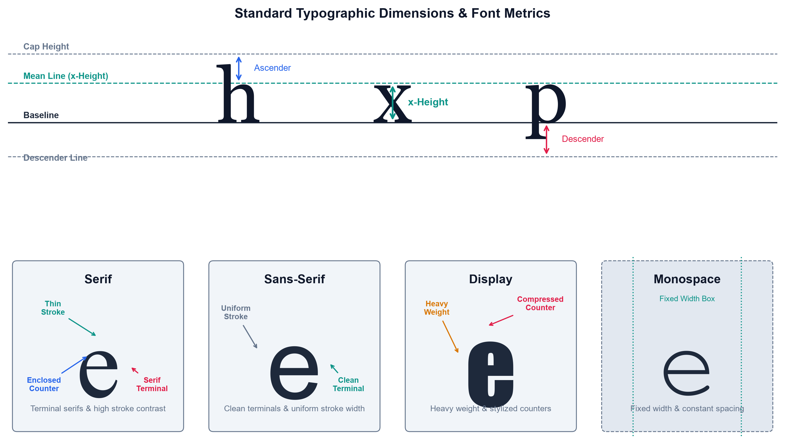
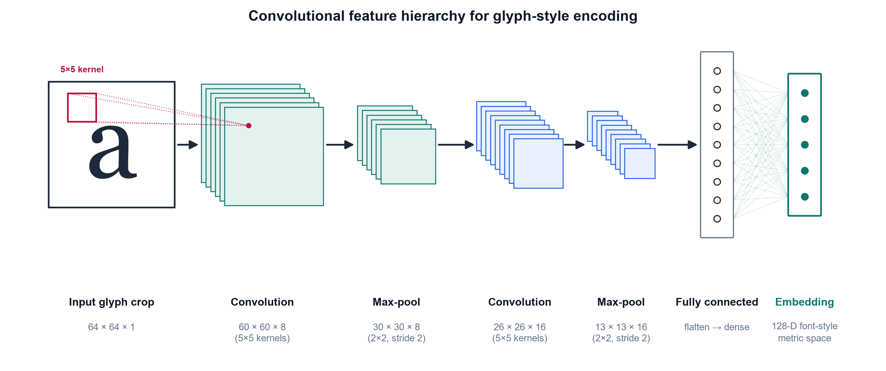
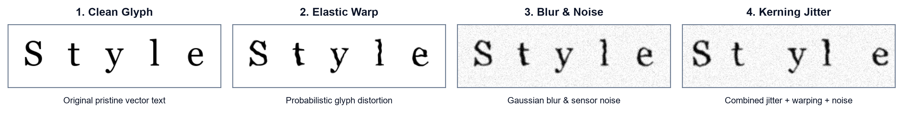
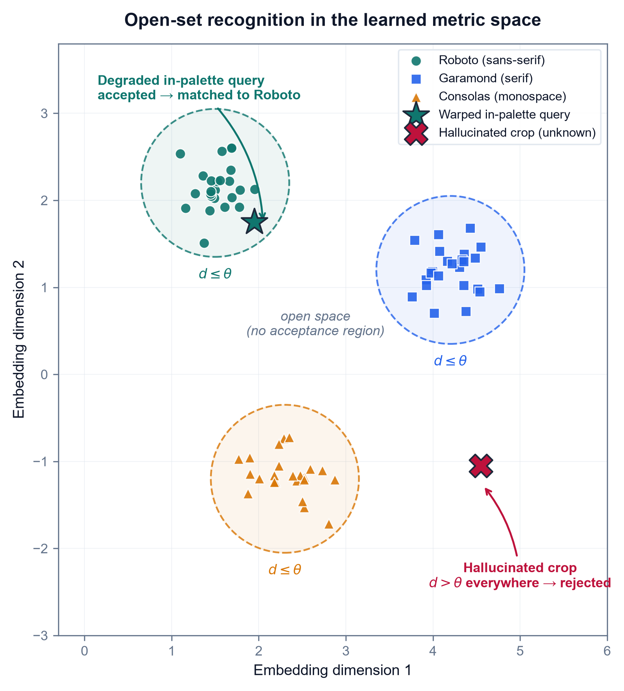
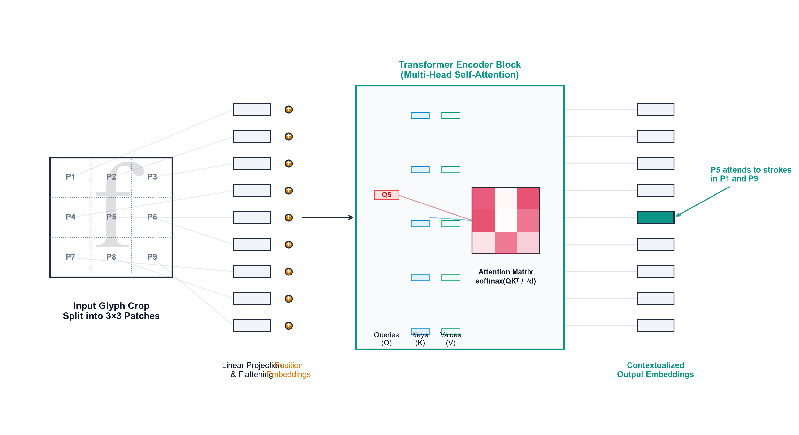
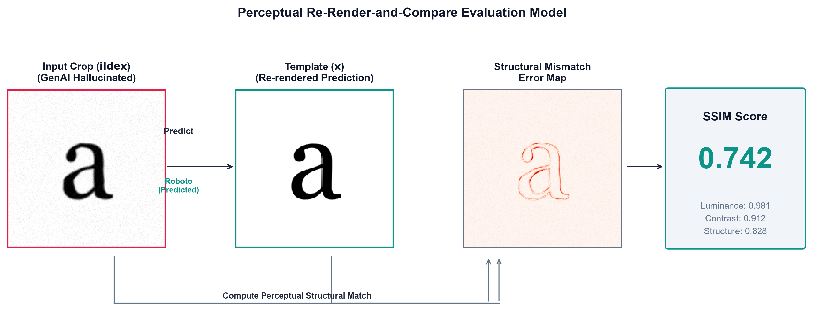
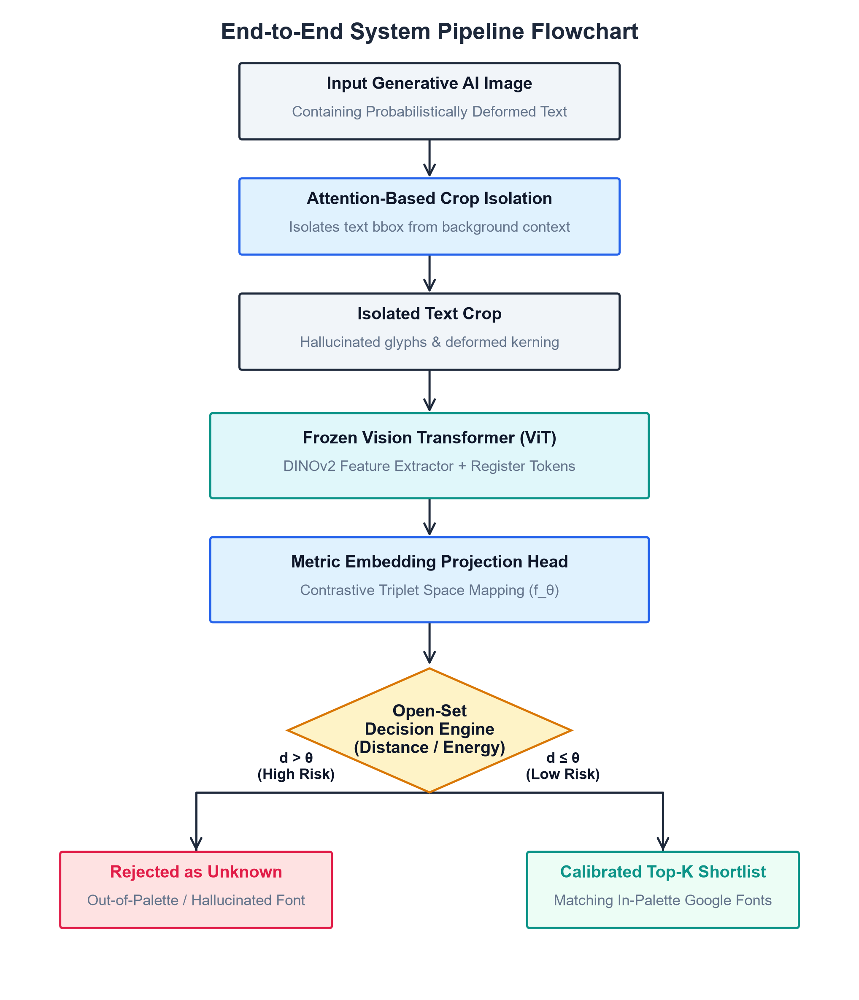

# Chapter 3 — Technical Background

## 3.1 Introduction to the Domain

This chapter equips the reader with the theoretical and technical foundation that the methodology assumes, moving deliberately from the general to the specific across four movements. It first situates the work within its parent computational fields and defines the core visual objects it manipulates — glyph anatomy, the typographic-hallucination model, the convolutional network, and the embedding space (Sections 3.1–3.2). It then supplies the mathematical engine that turns those objects into decisions: metric learning, which shapes an embedding space so that distance means typographic similarity, and open-set recognition, which lets the system refuse to answer (Section 3.3). Next it surveys the concrete software tools and neural architectures the framework is built on, each weighed for both what it does well and where it falls short (Section 3.4). Finally, it converges these threads onto the precise technical gap that motivates the thesis and hands off to the methodology (Section 3.5).

This research sits at the innermost layer of a nested set of computational fields. The outermost is **artificial intelligence (AI)**, the broad study of systems that perform tasks normally requiring human intelligence. Within AI lies **machine learning (ML)**, the subfield concerned with algorithms that improve at a task by learning statistical patterns from data rather than following hand-written rules (Sarker, 2021). Within ML sits **deep learning (DL)**, a family of methods that stack many layers of simple non-linear transformations so that the system learns its own hierarchical representation of the input, from raw pixels up to abstract concepts, without human-engineered features (LeCun, Bengio, & Hinton, 2015). When deep learning is applied to the interpretation of images, it becomes **computer vision (CV)**, the discipline of extracting meaning from visual signals such as photographs, documents, and rendered text.

Narrowing further, this thesis addresses a specialized CV task: **visual font-style recognition**, the problem of identifying which typeface a piece of rendered text was set in, using only the image of the text. The classical formulation of this task, established by DeepFont (Wang et al., 2015), treats it as image classification over a fixed catalogue of fonts rendered as clean, geometrically exact glyphs. The regime this thesis targets, however, is far harsher: text crops produced by generative AI image tools, in which the glyphs are probabilistically deformed rather than pristine. General-purpose vision-language models cannot solve this problem — Li, Song, et al. (2025) show that state-of-the-art multimodal models "get lost" in font recognition, derailed by the semantic content of the word instead of reading its visual texture. The remainder of this chapter builds, from the ground up, the concepts required to formalize and attack this specific problem.

## 3.2 Core Concepts & Definitions

### 3.2.1 Typography and Font Anatomy

**Typography** is the craft of arranging letterforms for legibility and visual effect. Its atomic unit is the **glyph**, the concrete visual shape of a single character (the drawn form of the letter "a," for example). A **typeface** is the underlying design of a coordinated set of glyphs, whereas a **font** is a specific digital file that implements that design at a particular weight and style; the two terms are often used interchangeably, but the distinction (design versus file) matters when cataloguing candidates. Typefaces are grouped into broad structural classes: **serif** faces carry small terminating strokes at the ends of letters; **sans-serif** faces omit them; **display** faces are ornamental designs intended for large sizes; and **monospace** faces give every glyph identical width.

These classes are distinguished by measurable structural traits. The **x-height** is the height of a lowercase "x," setting the visual size of the main body of the text; a **terminal** is the endpoint of a stroke (rounded, flat, or serifed); **stroke contrast** is the ratio between the thickest and thinnest parts of a stroke; and a **counter** is the enclosed or partially enclosed negative space inside letters such as "o" or "e." Figure 1 illustrates these traits across the four family classes.

**Figure 1**

*Font Anatomy Across Serif, Sans-Serif, Display, and Monospace Families*

As shown in Figure 1, font identity is carried by fine-grained geometric traits rather than by the identity of the character itself, which is precisely why this thesis reasons over visual texture instead of textual meaning.

### 3.2.2 Convolutional Neural Networks and Visual Feature Extraction

The dominant deep-learning tool for reading such visual traits is the **convolutional neural network (CNN)**, an architecture that exploits the spatial structure of images through local, weight-sharing operations (LeCun, Bengio, & Hinton, 2015). Its central operation is **convolution**, in which a small **kernel** (also called a filter — a compact matrix of learnable weights) is slid across the image, computing a weighted sum at every position:

$$(I * K)(i, j) = \sum_{m} \sum_{n} I(i+m,\, j+n)\, K(m, n)$$

Here $I$ is the input image (a two-dimensional array of pixel intensities), $K$ is the kernel, $(i, j)$ is the output spatial location, and $m, n$ index positions within the kernel. The resulting array is a **feature map**, an image in which each value records how strongly the kernel's pattern (an edge, a corner, a serif) is present at that location. The region of the input that influences a single feature-map value is that value's **receptive field**; stacking convolutional layers enlarges the receptive field, so deeper layers respond to progressively larger and more abstract structures (Goodfellow, Bengio, & Courville, 2016). The spatial size $O$ of a feature map is determined by the input and kernel geometry:

$$O = \left\lfloor \frac{W - F + 2P}{S} \right\rfloor + 1$$

where $W$ is the input width (in pixels), $F$ is the kernel size, $P$ is the amount of zero-padding added to the border, $S$ is the **stride** (the step size between kernel positions), and $\lfloor \cdot \rfloor$ denotes the floor function. Between convolutional layers, **pooling** downsamples each feature map — typically by taking the maximum value in each small window — which shrinks the representation and grants tolerance to small shifts in glyph position (Sarker, 2021). Figure 2 presents this convolution-pooling-classification pipeline.

**Figure 2**

*Simplified Architecture of a Convolutional Neural Network*

*Note.* Adapted from LeCun, Bengio, and Hinton (2015) and Goodfellow, Bengio, and Courville (2016).

As shown in Figure 2, a CNN processes an image through successive convolution and pooling stages before a fully connected block, enabling the hierarchical feature learning on which the later chapters depend.

### 3.2.3 Typographic Hallucination

The input distribution this thesis targets is not clean type but **typographic hallucination**: the probabilistic glyph deformation — micro-warping, elastic distortion, and variable kerning (inconsistent spacing between characters) — introduced when generative AI image models render text. Kondo et al. (2024) demonstrate that diffusion models natively emit novel, unclassified glyph geometries when interpolating in latent space, establishing that these deformations are an intrinsic output of the model class rather than an occasional artifact. To make this precise, hallucination is modeled here as a **degradation operator** $D$ applied to a pristine glyph crop:

$$\tilde{x} = D\big(x;\ \theta_{\text{warp}},\, \theta_{\text{blur}},\, \theta_{\text{kern}}\big)$$

where $x$ is the clean rendered crop, $\tilde{x}$ is the resulting hallucinated crop, and $D$ composes three parameterized corruptions: an elastic **warp** (governed by $\theta_{\text{warp}}$), **Gaussian blur and noise** ($\theta_{\text{blur}}$), and **kerning jitter** ($\theta_{\text{kern}}$). This operator, illustrated in Figure 3, is the formal object the synthetic-data pipeline of Chapter 4 will instantiate to train a deformation-robust recognizer. Modeling degradation as controlled, layered augmentation follows established practice: Plastropoulos and Tegos (2024) show that combining such transformations with deep feature extraction forces networks to learn resilient, continuous shape boundaries.

**Figure 3**

*The Typographic-Hallucination Degradation Pipeline*

As shown in Figure 3, each stage of $D$ moves the glyph further from its pristine form, reproducing the exact deformations that cause commercial font identifiers to fail.

### 3.2.4 Embedding Spaces

Rather than emit a single hard label, the framework maps each crop into an **embedding** — a fixed-length vector of real numbers, produced by a deep network, that summarizes the visual content of the input. The set of all such vectors forms an **embedding space**, a continuous geometric space in which proximity encodes similarity: crops set in the same typeface should land close together, and crops from different typefaces far apart (LeCun, Bengio, & Hinton, 2015). Representing fonts as points in a continuous space, rather than as entries in a fixed list, is what allows a hallucinated crop to be placed *near* its source typeface even when it matches none exactly — the property the theoretical foundations of the next section formalize.

## 3.3 Theoretical Foundations

Having defined the visual objects and the network that reads them, this section supplies the mathematical engine that turns embeddings into decisions. It proceeds from the general — how a model can be trained at all — to the two specific mechanisms this thesis assembles: **metric learning**, which shapes the embedding space so that distance means typographic similarity, and **open-set recognition**, which lets the system refuse to answer when a crop belongs to no known font.

### 3.3.1 Learning Paradigms

A deep network is trained by minimizing a **loss function**, a scalar-valued function that measures the gap between the model's output and the desired output; optimization adjusts the network's weights to make this quantity small. How the desired output is supplied defines the learning paradigm. In **supervised learning**, every training image carries a **label** — a human-assigned ground-truth answer, such as the font name — and the loss penalizes disagreement between prediction and label (Sarker, 2021). In **unsupervised learning** no labels exist, and the model must discover structure — clusters, factors, densities — from the raw inputs alone. **Self-supervised learning** occupies the middle ground: it manufactures a supervisory signal from the data itself (for instance, by asking the network to make two augmented views of one image agree), obtaining the benefits of supervision without manual annotation. This distinction matters directly because in-the-wild generative-AI crops arrive without font labels, pushing the thesis toward metric and self-supervised formulations rather than a purely supervised classifier.

### 3.3.2 Metric Learning and Embedding Distance

**Metric learning** is the family of methods that trains an **embedding function** $f_\theta$ — a network, with parameters $\theta$, mapping an input crop to a vector — so that geometric distance in the output space corresponds to semantic similarity (Schroff, Kalenichenko, & Philbin, 2015). Two distances are used to compare embeddings. The **Euclidean distance** between two crops $a$ and $b$ is

$$d(a, b) = \lVert f(a) - f(b) \rVert_2,$$

where $f(a)$ and $f(b)$ are their embedding vectors and $\lVert \cdot \rVert_2$ is the $L^2$ (straight-line) norm; smaller $d$ means greater similarity. **Cosine similarity** instead measures the angle between the two vectors,

$$\cos(a, b) = \frac{f(a) \cdot f(b)}{\lVert f(a) \rVert\, \lVert f(b) \rVert},$$

where $f(a) \cdot f(b)$ is the dot product; it ranges from $-1$ to $1$ and ignores vector magnitude, isolating direction.

To force these distances to encode font identity, the embedding is trained with a **triplet loss**. A triplet consists of an **anchor** crop $a$, a **positive** $p$ set in the *same* typeface as the anchor, and a **negative** $n$ set in a *different* typeface. The loss is

$$L = \sum_{i} \left[\, \lVert f(a_i) - f(p_i) \rVert^2 - \lVert f(a_i) - f(n_i) \rVert^2 + \alpha \,\right]_+,$$

where the sum runs over triplets, $\alpha$ is the **margin** (a minimum required gap between the anchor–positive and anchor–negative distances), and $[\,\cdot\,]_+ = \max(0, \cdot)$ keeps only positive violations (Schroff et al., 2015). Minimizing $L$ pulls same-font crops together and pushes different-font crops apart by at least $\alpha$. FaceNet established this on face identity, but was validated only on clean, photographic faces — not on deformed glyphs. Two complementary results extend the rationale to the regime here: Huang and Zhou (2022) show that deep networks can decompose intricate visual domains into structured feature vectors that support *continuous proximity rankings* rather than hard label buckets, and Umer et al. (2022) provide the optimization backing for tracking structural closeness on high-variance, distorted geometries. A cleaner space still helps: Wang et al. (2024) impose a non-negativity constraint on contrastive features, yielding sparse, disentangled, axis-aligned embeddings — though their guarantees, too, are demonstrated on standard benchmarks rather than typographic deformation.

### 3.3.3 Open-Set Recognition and Rejection Scores

A metric embedding still assumes every query belongs to some trained class. **Open-set recognition** removes that assumption: it partitions inputs into **known classes** (fonts seen in training) and the **unknown class** (anything else), and must reject the unknown instead of forcing it into a known bucket. The formal hazard is **open-space risk** $R_O(f)$ — conceptually, the fraction of the vast "open space" far from any training example that a recognizer nonetheless labels as a known font. Because a bounded amount of training data cannot fence off an unbounded space, minimizing $R_O(f)$ requires a **rejection score** — a scalar summarizing how confidently an input belongs to any known class — compared against a **threshold** below which the input is declared unknown (Lu et al., 2025). Figure 4 depicts this geometry.

**Figure 4**

*Embedding Space with Known-Font Clusters and an Open-Set Rejection Boundary*

As shown in Figure 4, known typefaces form compact clusters while a hallucinated, out-of-palette crop lands in the open region beyond the rejection boundary, which is exactly the case a threshold on the rejection score is meant to catch.

The rejection score can be read at several points in the network. Many scores start from the **logits** — the raw, pre-normalization outputs $f_i(x)$ of the classification layer for each class $i$ — which the **softmax** function converts to a probability distribution,

$$\sigma(z)_i = \frac{e^{z_i}}{\sum_j e^{z_j}},$$

where $z_i$ is the logit for class $i$ and the denominator sums over all classes so the outputs total one. Softmax confidence alone is a poor rejection score because networks are overconfident off-manifold; the recent literature therefore reads richer signals. Hofmann et al. (2024) compute an **energy score**,

$$E(x) = -T \cdot \log \sum_i \exp\!\big(f_i(x) / T\big),$$

where $T$ is a temperature constant and the sum runs over class logits; low energy indicates an in-distribution input and high energy flags the unknown, and they sharpen the boundary by mining hard outliers near it. Djurisic et al. (2024) keep the decision in logit space but rescale the whole logit vector by a feature-derived scalar before thresholding, requiring no retraining. Karunanayake et al. (2025) argue that the *ranking* of the runner-up classes is itself diagnostic — far more deterministic for known than unknown inputs — a framing that maps directly onto a Top-K font shortlist, where the order of the second- and third-place fonts signals a hallucinated glyph. The decisive limitation unifying all four is that every one of these scores is validated on natural-image out-of-distribution benchmarks (CIFAR, ImageNet); none has been tested on *typographic* out-of-distribution input — the probabilistic warping and variable kerning this thesis targets — leaving open whether they transfer to font hallucination over a localized palette, the question the methodology sets out to answer.

## 3.4 Existing Technologies & Frameworks

The theory of the previous section is realized through concrete software tools and neural architectures. This section surveys the ones the methodology builds on, and — following the requirement that every framework be judged on both sides — pairs each with what it does well *and* where it falls short on this thesis's deformed-glyph regime. The tools divide into a *representation* stack (a library, a backbone architecture, and a frozen encoder) and a *measurement* stack (structural-similarity metrics), followed by the generative process that produces the input distribution in the first place.

### 3.4.1 PyTorch and the Vision Transformer Backbone

A deep-learning **framework** is a software library that supplies the building blocks — tensor operations, automatic differentiation, and pre-built layers — for defining and training networks. **PyTorch** is the framework adopted here; its central strength is a **dynamic computation graph**, meaning the network structure is defined on the fly as code executes, together with **autograd**, which automatically computes the gradients that optimization needs. This flexibility makes PyTorch well suited to research prototyping, but it is deliberately domain-agnostic: it provides no built-in typographic priors, so all font-specific structure must be supplied by the model and data the researcher constructs.

The backbone architecture is the **Vision Transformer (ViT)**, which processes an image not through convolution but by splitting it into a grid of fixed-size **patches**, flattening each patch into a **patch embedding** (a vector), and letting the patches interact through **self-attention**. Self-attention, introduced by Vaswani et al. (2017), lets every element of a sequence weigh the relevance of every other element. Each patch embedding is projected into three vectors — a **query** $Q$, a **key** $K$, and a **value** $V$ — and the operation is

$$\text{Attention}(Q, K, V) = \text{softmax}\!\left(\frac{QK^\top}{\sqrt{d_k}}\right) V,$$

where $QK^\top$ scores how well each query matches each key, $d_k$ is the key dimension whose square root rescales the scores to keep them numerically stable, softmax turns the scores into weights summing to one, and $V$ carries the aggregated content. Figure 5 depicts this patch-embedding-and-attention flow.

**Figure 5**

*Vision Transformer Patch Embedding and Self-Attention*

*Note.* Adapted from Vaswani et al. (2017) and Wang, Lv, et al. (2025).

As shown in Figure 5, self-attention links spatially distant patches directly, which is why Wang, Lv, et al. (2025) use a ViT to parse long-range document layout that fixed convolutional receptive fields cannot span. The limitation is twofold: self-attention is **data-hungry**, requiring large training sets to generalize, and its all-pairs comparison has **quadratic cost** in the number of patches, making high-resolution inputs expensive.

### 3.4.2 Self-Supervised Frozen Encoders

Training a ViT from scratch is precisely the data-hungry step this thesis wants to avoid. **DINOv2** (Oquab et al., 2024) is a ViT trained by self-supervised distillation to produce *all-purpose* visual features that transfer to fine-grained classification and retrieval with no fine-tuning. Used as a **frozen encoder** — its weights held fixed while only downstream components are trained — it lets the framework read patch-level embeddings from a glyph crop without building a font-specific network from scratch, and Sheikh et al. (2024) show the same frozen-DINO family extracting layout structure with no labels at all. Its weakness is that these features are not clean: Darcet et al. (2024) identify high-norm **artifact tokens** that self-supervised ViTs repurpose for internal computation in low-information image regions, corrupting the feature map. Their fix is **register tokens** — extra dedicated tokens that absorb this internal computation — which restore smooth attention and feature maps. That repair matters directly for glyph crops, whose informative signal is a few thin strokes on empty ground; yet, like the backbone itself, registers are validated only on natural images, never on re-rendered type.

### 3.4.3 Structural-Similarity Metrics

To score how well a predicted font matches a crop, the framework needs a **structural-similarity metric** — a measure of perceptual, structural agreement rather than pixel-by-pixel identity. The foundational one is the **Structural Similarity Index (SSIM)** of Wang et al. (2004), which models similarity as a product of luminance, contrast, and structure terms:

$$\text{SSIM}(x, y) = \frac{(2\mu_x \mu_y + C_1)(2\sigma_{xy} + C_2)}{(\mu_x^2 + \mu_y^2 + C_1)(\sigma_x^2 + \sigma_y^2 + C_2)},$$

where $\mu_x, \mu_y$ are the mean intensities of the two image windows $x$ and $y$, $\sigma_x^2, \sigma_y^2$ their variances, $\sigma_{xy}$ their covariance, and $C_1, C_2$ small constants that prevent division by zero. SSIM is interpretable and computationally light, but classical pixel-SSIM collapses under **geometric misalignment** — when the two images are warped or shifted relative to each other — which is the normal case for a hallucinated glyph. Figure 6 illustrates the re-render-and-compare protocol this metric serves.

**Figure 6**

*Structural-Similarity Re-Render-and-Compare Pipeline*

As shown in Figure 6, the predicted typeface is re-rendered and scored against the input crop, which is exactly where classical SSIM's alignment assumption breaks. Two deep successors address this: Zhang et al. (2024) compute **DeepSSIM** over deep feature maps with an attention-calibration step, keeping the score valid under geometric misalignment, and Li et al. (2025) build **SAMScore** on segmentation-model embeddings to measure whether a transformed image preserves source *content structure*. Both are deformation-robust in principle, but both were validated on natural-image translation tasks, never on re-rendered glyphs — the untested transfer this thesis must confront.

### 3.4.4 Latent Diffusion as the Generative Source

Finally, the input distribution itself originates from **latent diffusion**, the class of generative models that synthesize images by iteratively denoising a compressed latent representation. Kondo et al. (2024) show that interpolating in this latent space natively emits novel, unclassified glyph geometries with fluid visual traits — peer-reviewed evidence that typographic deformation is intrinsic to the model class. Its strength as a generator is precisely its weakness for this thesis: the process is uncontrolled with respect to font identity, producing glyphs that belong to no catalogued typeface. Diffusion is therefore the disease this framework must diagnose, not a cure — the motivation for treating its deformed output as the input distribution the following chapter's pipeline is engineered to handle.

## 3.5 Problem Context

Having assembled the concepts, theory, and tooling, this section states plainly why no existing solution suffices on the input distribution this thesis targets: the **in-the-wild GenAI crop**, a fragment of text lifted from a generative-AI image whose glyphs are probabilistically deformed rather than pristine. Each mature tool excels on the distribution it was built for and fails on this one.

Classical OCR and closed-boundary layout analysis are the first casualty. Ponnuru et al. (2024) digitize smudged, handwritten prescriptions at a 98% accuracy baseline, proving that traditional pipelines handle *environmental* noise on anatomically correct text with ease; but their adaptive-thresholding and bounding-box machinery presupposes rigid glyph geometry, which the topological warping of hallucinated type dissolves. The DeepFont-style `font-classify` baseline established in Section 3.2 fails for a different reason: trained on clean synthetic glyphs, it is **pristine over-fit** — tuned so tightly to geometrically exact vectors that deformed input falls off its learned manifold — and **closed-set**, meaning it assumes every query belongs to a catalogued class and is therefore forced to return some known font even when the true typeface is absent. The measurement tools inherit the same brittleness: classical pixel-SSIM (Section 3.4) demands **pixel registration** — an exact per-pixel correspondence between the two images — that warped, re-kerned glyphs break outright. Reaching for a general vision-language model is no escape, either; Li, Song, et al. (2025) show that state-of-the-art VLMs get lost in font recognition, derailed by the word's semantic content instead of reading its visual texture. Even the closest typographic precedent falls short: the L2@k and cos@k font-fidelity metrics of Jiang et al. (2025), computed over the very Storia-AI classifier this thesis adopts as its baseline, assume an *undeformed* input glyph and so cannot faithfully score a hallucinated crop. That the deformation is endemic rather than incidental is settled by Liu et al. (2024), who find that an uncorrected generative pipeline renders text correctly less than 20% of the time — the empirical size of the problem this thesis exploits.

These failures converge on a single **consolidated gap**. No existing framework couples an attention-isolated text crop → a deformation-robust, frozen-ViT metric embedding → open-set font-identity ranking with a calibrated Top-K over a **localized open-set palette** (the top 50–100 Google Fonts) on the GenAI-deformed input distribution. Figure 7 previews the end-to-end framework this thesis assembles to occupy that gap.

**Figure 7**

*End-to-End Architecture of the Proposed Font-Style Recognition Framework*

As shown in Figure 7, an isolated crop flows through the frozen-ViT encoder into a metric embedding, where an open-set rejection score and a calibrated Top-K produce a ranked shortlist over the localized Google-Fonts palette — the precise coupling that the preceding tools, taken singly, leave unbuilt.

Having established the typographic, deep-learning, metric-learning, and open-set foundations — and the specific technical gap they leave open — the next chapter details the synthetic-degradation pipeline that manufactures deformed training data, the model architecture that embeds and ranks each crop, and the evaluation protocol that measures the framework against a human-proxy baseline.
