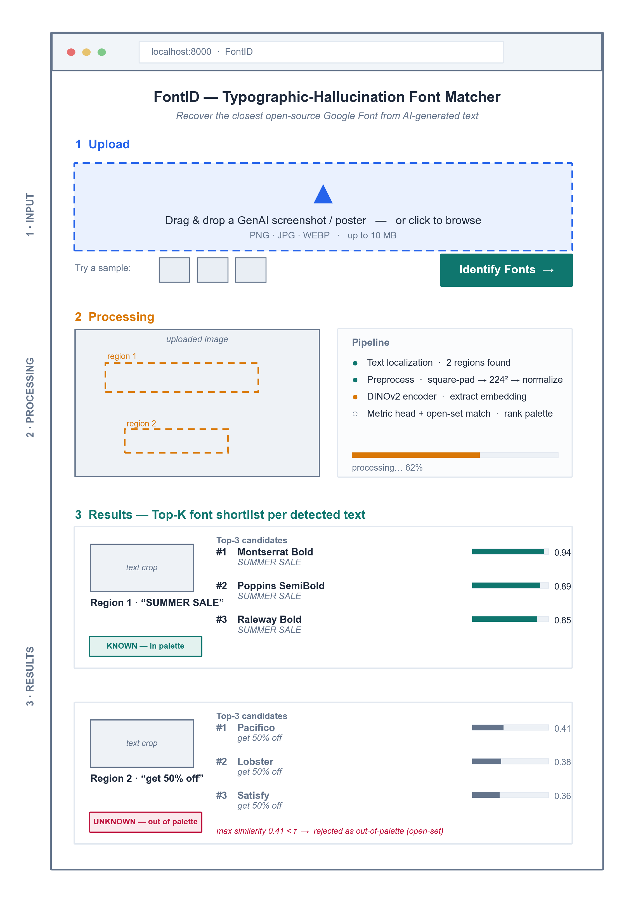

# Software Requirements Specification

**FontID — Typographic-Hallucination Font Matcher**
Web demonstrator for *"Addressing Typographic Hallucination in Generative AI Images: An Open-Set Metric Learning Approach to Font Style Recognition."*

Version 1.0 · IEEE 830 / ISO·IEC·IEEE 29148 (thesis-scoped)

| Date | Version | Description | Author |
| :--- | :--- | :--- | :--- |
| 2026-07-16 | 1.0 | Initial thesis-scoped SRS | Research team |

---

## 1. Introduction

### 1.1 Purpose
This document specifies the requirements for **FontID**, the web demonstrator that exposes the thesis's font-recognition model to a user. It is the *artifact* half of the study's build method (§4.10): a single-page application that accepts a generative-AI image, runs the open-set metric-learning pipeline, and returns a ranked shortlist of the closest Google Fonts for each detected line of text — or rejects the text as out-of-palette. The document is written for the two researchers (developers), the faculty adviser, and the panel evaluating the demonstrator.

Requirements use **shall** for mandatory behavior, **should** for desired behavior, and are labeled `REQ-<section>-<n>` with priority **High / Med / Low**.

### 1.2 Scope
FontID is a **local demonstration harness**, not a production service. It wraps the trained model so that hallucinated text crops map to a localized palette of the top 50–100 Google Fonts for free template reconstruction. Explicitly **out of scope**: user accounts, multi-user scaling, persistent storage, payment/licensing, and font vectorization. The app is single-page with three zones — **Input → Processing → Results** — and runs on one machine for the defense demo.

### 1.3 Definitions and Acronyms
| Term | Meaning |
| :--- | :--- |
| Typographic hallucination | Probabilistic glyph deformation (warping, kerning jitter, smear) that GenAI introduces into rendered text. |
| Palette | The curated closed set of 50–100 known Google Fonts the model can name. |
| Open-set / reject | Returning "unknown" when a crop's best match falls below threshold **τ**, instead of forcing a wrong label. |
| Top-K | The K highest-ranked font candidates for one text crop (K = 3 in the demo). |
| Embedding | The fixed-length style vector produced by the DINOv2 encoder + metric head. |
| SSIM | Structural Similarity Index — re-render score between the input crop and the predicted font. |

---

## 2. Overall Description

### 2.1 Product Perspective
FontID is a **new, self-contained** front end over an existing trained model; it adds no new learning logic. The runtime path is layered — React client → FastAPI backend → PyTorch inference service → model weights and font assets — as detailed in the system-architecture diagram (Ch4 §4.5.2, Fig 9). The trained metric head is produced offline; the app only *loads and serves* it.

### 2.2 Product Functions
- Accept a GenAI image by drag-drop, file browse, or bundled sample.
- Localize the text region(s) in the image and crop each one.
- Embed each crop and rank it against the font palette.
- Return a Top-K shortlist per crop with a similarity score, or reject it as out-of-palette.
- Render each candidate font as a live preview of the detected text for visual confirmation.

### 2.3 User Classes
| User class | Characteristics | Use of the app |
| :--- | :--- | :--- |
| Designer / end user | Non-technical; wants a free font match to rebuild a template. | Uploads an image, reads the Top-K shortlist. |
| Researcher / evaluator | The team + panel; technical. | Drives the demo, inspects scores, confirms open-set reject behavior. |

### 2.4 Operating Environment
- **Client:** current Chrome / Firefox / Edge (latest two versions), desktop viewport.
- **Server:** Python 3.11+, FastAPI, PyTorch, packaged with Docker; runs on the presenter's laptop (`localhost`). GPU optional — CPU inference acceptable for single-image demo latency.
- **Assets:** DINOv2 + baseline weights from HuggingFace Hub; Google Fonts files for palette matching and preview rendering.

### 2.5 Design and Implementation Constraints
- Stack is fixed by the methodology (§4.8): **React** (frontend), **FastAPI** (backend), **PyTorch + HuggingFace** (inference), **Docker** (deploy).
- Preprocessing (square-pad → 224² → ImageNet normalize) **shall** run inside the model forward pass to avoid train–serve skew (§4.3.2).
- Only open-source fonts (the Google Fonts palette) may be returned — no commercial font identifiers or licenses.

### 2.6 Assumptions and Dependencies
- The trained metric head and palette are available on disk at startup.
- The uploaded image contains legible rendered text (not handwriting / heavy occlusion).
- The off-the-shelf text-localization component is available and returns bounding boxes.

---

## 3. External Interface Requirements

### 3.1 User Interface
Single page, three vertically stacked zones (wireframe below):

1. **Input** — a drag-drop/browse dropzone, sample thumbnails, and an **Identify Fonts** action.
2. **Processing** — the uploaded image with detected text regions boxed, plus a pipeline status/progress indicator.
3. **Results** — one card per detected crop: the crop thumbnail, its Top-K font shortlist (name · preview · similarity bar), and a **KNOWN / UNKNOWN** badge for the open-set decision.

The interface **shall** work at desktop widths and keep all three zones reachable on one page. Standard affordances: every result font preview offers a copy-name / preview action.

*Figure. FontID wireframe: three-zone single page. Region 1 accepts (Top-3 in palette); Region 2 is rejected as out-of-palette (max similarity < τ), demonstrating open-set behavior.*

### 3.2 Software Interfaces
| Interface | Purpose | Data exchanged |
| :--- | :--- | :--- |
| `POST /predict` (FastAPI REST) | Client sends the image; server returns results. | Request: image (multipart). Response: JSON — per crop, bounding box + Top-K `{font, score}` + `known` flag. |
| HuggingFace Hub | Load DINOv2 + baseline weights at startup. | Model tensors (read-once). |
| Google Fonts assets | Palette matching + preview rendering of candidate fonts. | Font files (`.ttf`/`.woff2`). |

All client–server traffic is local HTTP over `localhost`.

---

## 4. System Features (Functional Requirements)

### 4.1 Image Input — Priority: High
User supplies a GenAI image. **Stimulus/response:** user drops/selects an image → client shows a preview and enables **Identify Fonts** → click posts to `/predict`.

| ID | Requirement | Priority |
| :--- | :--- | :--- |
| REQ-4.1-1 | The system shall accept an image via drag-drop, file picker, or a bundled sample. | High |
| REQ-4.1-2 | The system shall accept PNG, JPG, and WEBP up to 10 MB and reject other types with a clear message. | High |
| REQ-4.1-3 | The system shall display a preview of the uploaded image before processing. | Med |

### 4.2 Text Localization and Processing — Priority: High
The backend finds text regions and prepares each crop. **Stimulus/response:** `/predict` receives the image → localizer returns boxes → each crop is preprocessed and embedded → status advances in the Processing zone.

| ID | Requirement | Priority |
| :--- | :--- | :--- |
| REQ-4.2-1 | The system shall detect one or more text regions and crop each region for independent matching. | High |
| REQ-4.2-2 | The system shall preprocess each crop (square-pad → 224² → normalize) inside the model forward pass. | High |
| REQ-4.2-3 | The system shall show processing status/progress and detected-region boxes while inference runs. | Med |
| REQ-4.2-4 | The system should return an informative error if no text region is found. | Med |

### 4.3 Font Matching and Top-K Results — Priority: High
For each crop, rank the palette and decide known vs. unknown. **Stimulus/response:** embedding is compared to the palette → if best similarity ≥ τ, return ranked Top-K; else mark the crop out-of-palette.

| ID | Requirement | Priority |
| :--- | :--- | :--- |
| REQ-4.3-1 | The system shall return a Top-K (K = 3) ranked shortlist of Google Fonts per crop, each with a similarity score. | High |
| REQ-4.3-2 | The system shall reject a crop as "unknown / out-of-palette" when its best similarity falls below threshold τ (open-set). | High |
| REQ-4.3-3 | The system shall present each crop's result as its own card, labeled KNOWN or UNKNOWN. | High |
| REQ-4.3-4 | The system should report a typographic-distance (SSIM) score between the crop and the top match. | Low |

### 4.4 Font Preview — Priority: Med
Let the user visually confirm a match. **Stimulus/response:** for each candidate the app renders the detected text string in that font.

| ID | Requirement | Priority |
| :--- | :--- | :--- |
| REQ-4.4-1 | The system shall render each shortlisted font as a live preview of the detected text. | Med |
| REQ-4.4-2 | The system should let the user copy a candidate font's name for reuse. | Low |

---

## 5. Non-Functional Requirements

### 5.1 Performance
| ID | Requirement | Priority |
| :--- | :--- | :--- |
| REQ-5.1-1 | The system shall return results for a single-image, ≤5-region upload within ~10 s on the demo laptop (CPU acceptable). | High |
| REQ-5.1-2 | Model weights shall load once at startup, not per request. | High |

### 5.2 Usability
| ID | Requirement | Priority |
| :--- | :--- | :--- |
| REQ-5.2-1 | A first-time user shall complete upload → results without instructions, in one page with no navigation. | High |
| REQ-5.2-2 | Scores and known/unknown status shall be visible without interaction. | Med |

### 5.3 Reliability and Portability
| ID | Requirement | Priority |
| :--- | :--- | :--- |
| REQ-5.3-1 | The system shall handle an unreadable/oversized/textless upload without crashing, returning a clear message. | High |
| REQ-5.3-2 | The system shall run from a single Docker image on a clean machine with no manual dependency setup. | Med |

*Security note: as a single-user local demo the app has no authentication, no persistence, and stores no uploads beyond the request lifetime; uploaded images are processed in memory and discarded.*

---

## Appendix A — Traceability
Functional features 4.1–4.4 realize the §4.5.1 functional requirements (upload · isolate crop · Top-K or unknown · font preview) and are served by the §4.5.2 architecture (Fig 9). Zones in the §3.1 wireframe map one-to-one to features 4.1 (Input), 4.2 (Processing), and 4.3–4.4 (Results).
